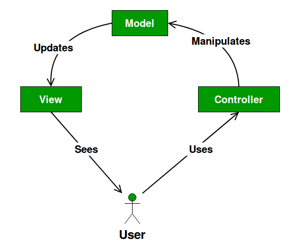
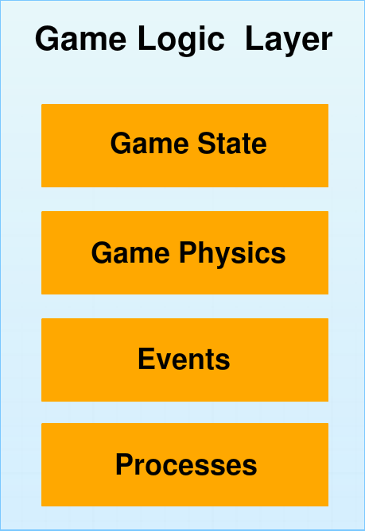
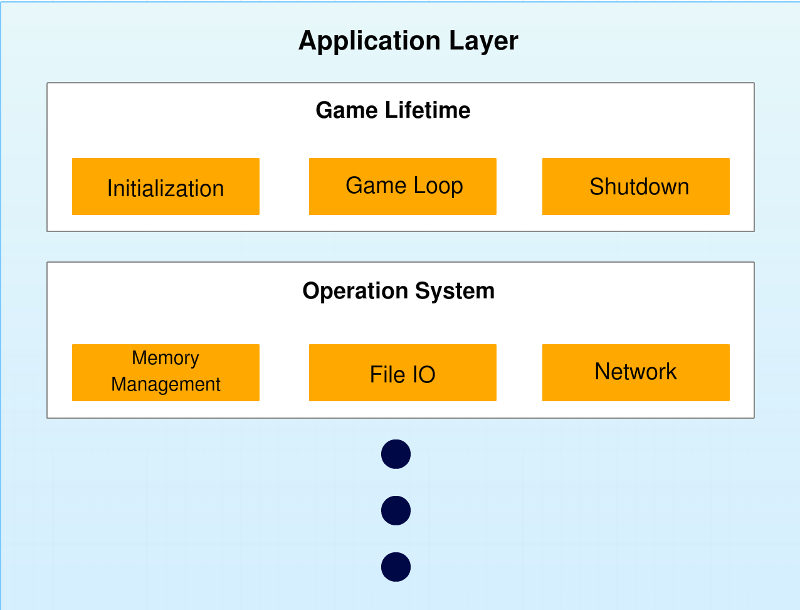

# **서론**
마지막 포스트 업로드 한지 꽤나 오랜 시간이 지났다. 개인적으로 진행했던 프로젝트에 집중하느라 포스팅에 집중하지 못하였다. (사실 핑계에 가깝다 ㅠㅠ) 이제부터는 정기적으로 포스트를 계속해 나가려한다.
이제 부터 본격적으로 엔진 아키텍처에 관해서 이야기할 계획이다. 이번 포스트에선 어떤 방식으로 Beluga 엔진의 코드 구조를 여러 레이어로 나누었는지 이야기 해보려한다.
Beluga 엔진의 기본 뼈대는 MVC 패턴을 이용한다. 

 

# **Back to the Basic : MVC**
MVC란 Model-View-Controller의 약자로, 소프트웨어를 개발할때 흔히 쓰이는 디자인 패턴이다. UI 같이 어플리케이션의 상호작용 레이어와 연관된 분야에서 특히나 많이 찾아볼 수 있다. 어느정도 능숙한 개발자라면 한번쯤은 들어보거나 지금도 활용하고 있을것이다. 웹 개발 분야에서 많이 쓰이는, Java, Python, Javascript, C# 등 많은 프로그래밍 언어들이 MVC 프레임워크를 지원한다.

MVC는 프로그램 로직을 Model, View, Controller 이 세개의 레이어로 분리한다. 각각을 간단히 설명하자면 다음과 같다.

### **Model**
 - 순수한 데이터. 

### **View**
 - 데이터를 변형하고, 볼 수 있게 해주는 인터페이스.

### **Controller**
 - 데이터와 인터페이스를 연결하는 매체. 뷰에서 발생한 모든 이벤트들을 듣고, 상황에 맞는 반응을 실행함.

  이렇게 아키텍처를 분리시켜놓으면 아래의 이점들이 발생한다. 
1. 소프트웨어가 가지고 있는 기본 역활을 유지할 수 있음.
2. 새로운 기능을 추가하거나 다른곳에 영향을 주는 부분을 수정하기 쉬움.

MVC 패턴에 관한 좀 더 자세한 내용은 추후 디자인 패턴 시리즈에서 다룰 예정이다.

 이미지 출처: https://www.geeksforgeeks.org/mvc-design-pattern/

 

# **MVC를 활용한 게임 엔진 아키텍처**

## 구조에 변형을 거치자.
MVC 패턴을 게임 엔진을 만드는데 활용하면, 게임은 모델, 엔진은 뷰, 그리고 컨트롤러는 엔진과 게임을 연결해주는 코드로 표현할 수 있다. 하지만 곧장 이 패턴을 사용하는 것 보다는, 게임 엔진에 맞게끔 변형을 하였다. 여러 플랫폼에서 작업 할수 있기를 원했고, 특정 플랫폼에 귀속된 코드를 최소화 하기 위해서이다. 그래서 여러 레이어로 쪼개면서, 구조에 변형을 거쳤다.
 

Model은  Game Logic Layer 가 대응한다. Game Logic Layer는 게임 상태(Game State), 게임 월드와 같은 큰 부분을 관리한다. View는 게임에서 사용될 플레이어블 캐릭터나, AI 캐릭터들 같이 각자만의 로직이 필요한 부분을 담당한다. 굉장히 여러곳에서 쓰이기 때문에 추후 게임 액터를 다루는 부분에서 다시 한번 설명하겠다. 마지막으로 Controller는 View와 통합시켰다. 그 후, 특정 플랫폼 코드를 다룰 Application Layer를 추가하였다.
 

## GameLogic Layer
게임 로직 레이어는 실질적인 게임 코드들이 작성되는 가장 중요한 레이어중 하나이다. 게임 월드에 관한 모든 권한을 가지며, 관리하는 레이어이다. 이번 포스트에선 자세하게 다루지는 않지만, 게임 월드에서 무엇이 이루어질지 정하는 게임 로직 레이어는, 프로그램상 단, 한개만이 존재할 수 있다.

게임 로직 레이어는 아래의 항목들을 다룬다.
- 게임 상태 : 실제 게임의 상태를 관리
- 게임 이벤트 : 게임 내에서 일어나는 사건들.
- 게임 프로세스 : 게임의 이산 논리
- 게임 물리 : 게임 상태에 따른 물리 시뮬레이션

이중 여러 항목들의 구현은 게임 로직 레이어 이루어지지 않고, 게임에서 재사용할 수 있도록 엔진 측에서 구현된다. 그 뒤, 각 게임에 맞게끔 항목들을 상속한뒤, 자세한 부분들을 게임 측에서 구현하면 된다.

## Application Layer
앞서 말했듯이 Application Layer는 특정 플랫폼이나 특정 API에 귀속된 코드를 다루며, 해당 부분을 추상화하고 관리하는 레이어다. 게임은 그래픽스 API로 DirectX를 사용할지, OpenGL을 사용할지는 신경쓸 필요가 없다. 그저 화면에 오브젝트를 랜더링하는 함수를 호출만 해주면 된다. 어떤 API를 활용하는지는 엔진에서 신경써야하는 부분이다.

이런 개념은 그래픽스 API 뿐만 아니라, Windows나 MacOS 같은 운영체제, Xbox, PlayStation, switch 같은 하드웨어에 대한 지원을 다룰때도 마찬가지이다. 

Beluga Engine의 Application Layer는 아래의 항목들을 관리한다.
- 게임 초기화, 강제종료, 게임 플레이 루프
- 파일 읽기, 쓰기, 탐색,
- 랜더링
- 입력 장치 관리
- 오디오
- 메모리 관리 (현재 통합 중)

현재는 이정도지만, 아래의 항목들도 Application Layer가 관리할 수 있다.
- 네트워크 통신
- 시스템 시간
- 문자열 핸들링

각각의 항목들은 API에 따라 또는 플랫폼에 따라 확연한 차이가 있을 수 있다. 사용하는 플랫폼에 따라 알아서 분리된 코드들을 알아서 연결해주고, 새로운 플랫폼에 대한 지원을 추가할때, 엔젠의 모든 구조를 바꿀 필요 없이 해당 플랫폼의 코드만 추가해주면 되는 레이어를 두면, 추후에 발생할 수 있는 작업을 최소화 할수 있다. 

## View Layer
View 레이어는 게임 월드 안에 존재한다. MVC의 Controller 부분이 View 레이어에 통합이 되었기 때문에, 유저의 입력을 관리하며, 해당 입력을 상황에 맞게 번역하여 게임 월드에 전달하는 역활을 한다.

View는 게임내에서 여러가지 구현의 조합으로 존재할 수 있다. 예를 들어 플레이어 캐릭터 뷰의 경우에는, 유저의 입력을 처리하고, 그래픽스 옵션을 커스터마이징 하거나 키 바인딩을 처리할 수 있다. AI 캐릭터를 위한 뷰는 플레이어 캐릭터의 위치를 찾는 기능이나, 주변에서 발생한 소리에 따른 행동을 선택하는 기능들이 들어가있을 수 있다. 각각의 AI 캐릭터들은 각자 다른 능력과 행동을 가질 수 있다. 그렇기에, 각 타입에 대한 뷰들을 구현해줘야한다.

# **코드 구현**
포스팅을 잠시 멈춘 동안, 주변 개발자들과 이야기를 나누었다.