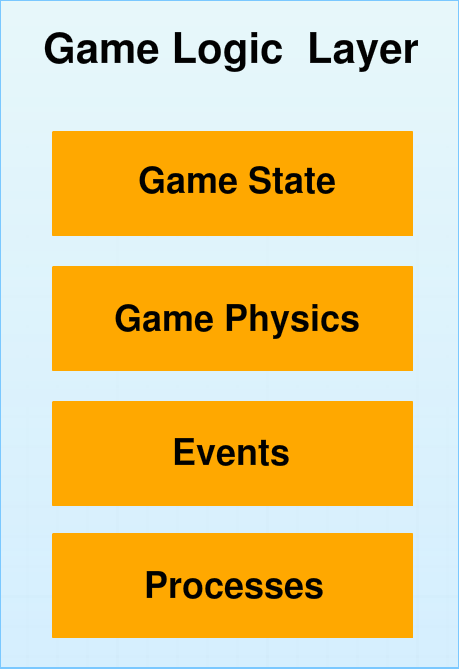
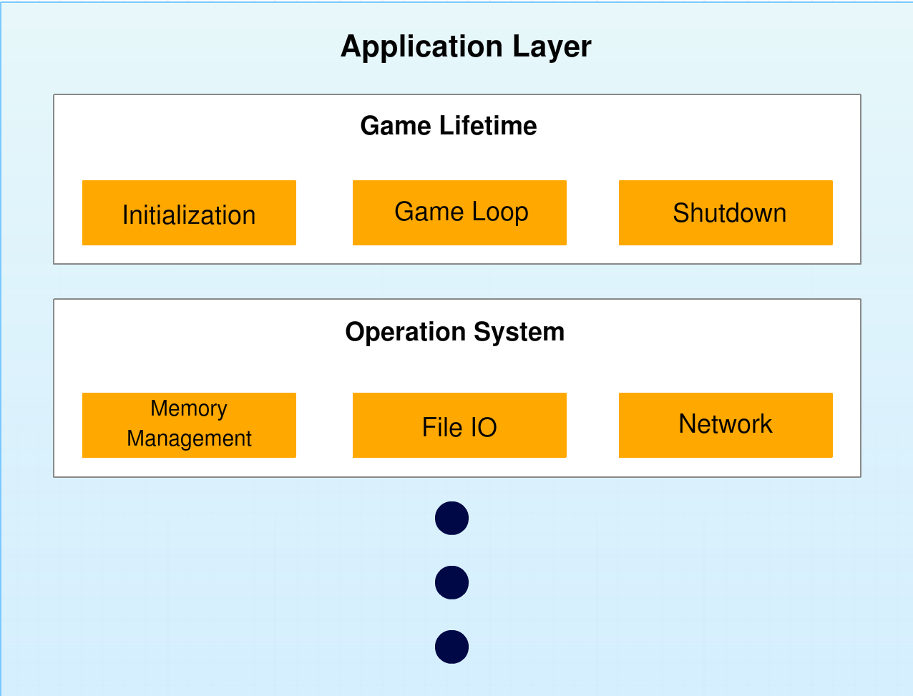
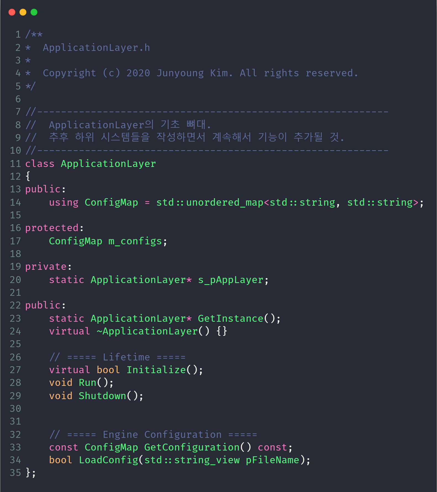
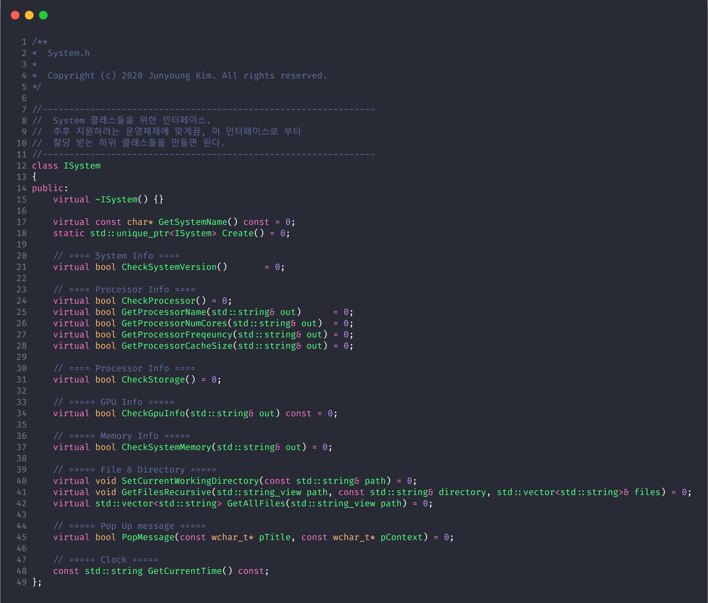
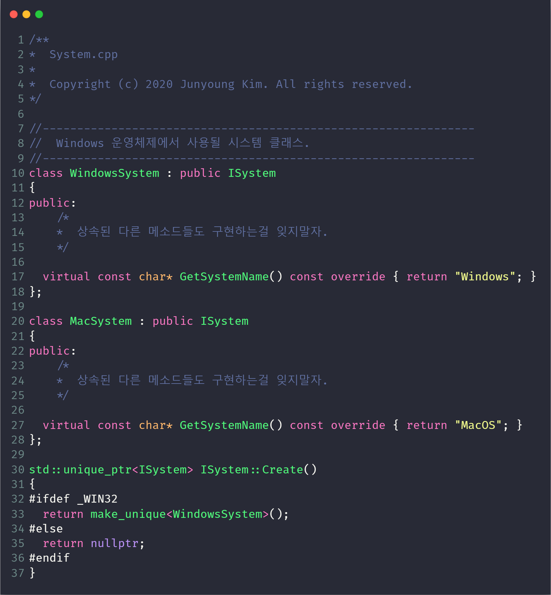
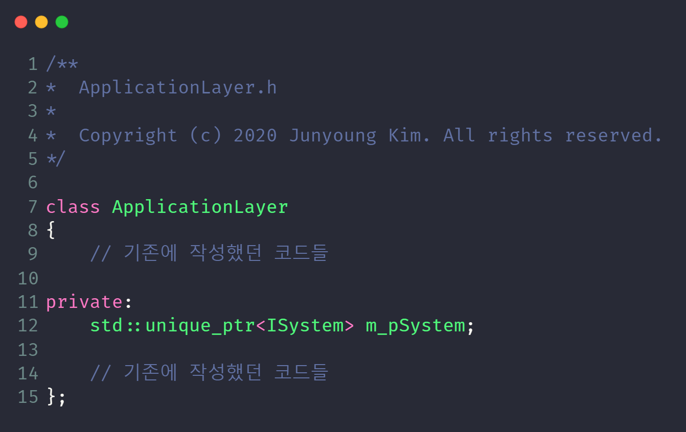

# **서론**
마지막 포스트 올린 지 꽤 오랜 시간이 지났다. 개인적으로 진행했던 프로젝트에 집중하느라 포스팅에 집중하지 못하였다. (사실 핑계에 가깝다 😥) 이제부터는 정기적으로 포스트를 계속해 나가려 한다. 이제부터 본격적으로 엔진 아키텍처에 관해서 이야기할 계획이다. 이번 포스트에선 어떤 방식으로 Beluga 엔진의 코드 구조를 여러 계층으로 나누었는지 이야기 해보려 한다. Beluga 엔진의 기본 뼈대는 MVC 패턴을 이용한다.

<br>

# **Back to the Basic : MVC**
MVC란 Model-View-Controller의 약자로, 소프트웨어를 개발할 때 흔히 쓰이는 디자인 패턴이다. UI 같이 애플리케이션의 상호작용 레이어와 연관된 분야에서 특히나 많이 찾아볼 수 있다. 어느 정도 능숙한 개발자라면 한 번쯤은 들어보거나 지금도 활용하고 있을 것이다. 웹 개발 분야에서 많이 쓰이는, Java, Python, Javascript, C# 등 많은 프로그래밍 언어들이 MVC 프레임워크를 지원한다.

MVC는 프로그램 로직을 Model, View, Controller 이 세 개의 레이어로 분리한다. 각각을 간단히 설명하자면 다음과 같다.

### **Model**
 - 순수한 데이터. 

### **View**
 - 데이터를 변형하고, 볼 수 있게 해주는 인터페이스.

### **Controller**
 - 데이터와 인터페이스를 연결하는 매체.<br>뷰에서 발생한 모든 이벤트를 듣고, 상황에 맞는 반응을 실행함.

<br><br>이렇게 아키텍처를 분리해놓으면 아래의 이점들이 발생한다.<br>
1. 소프트웨어가 가지고 있는 기본 역할을 유지할 수 있음.
2. 새로운 기능을 추가하거나 다른 곳에 영향을 주는 부분을 수정하기 쉬움.

MVC 패턴에 관한 좀 더 자세한 내용은 추후 디자인 패턴 시리즈에서 다룰 예정이다.


<br>이미지 출처: https://www.geeksforgeeks.org/mvc-design-pattern/

<br>

# **MVC를 활용한 게임 엔진 아키텍처**

## **구조에 변형을 거치자.**
MVC 패턴을 게임 엔진을 만드는 데 활용하면, 게임은 모델, 엔진은 뷰, 그리고 컨트롤러는 엔진과 게임을 연결해주는 코드로 표현할 수 있다. 하지만 곧장 이 패턴을 사용하는 것보다는, 게임 엔진에 맞게끔 변형을 하였다. 여러 플랫폼에서 작업 할 수 있기를 원했고, 특정 플랫폼에 귀속된 코드를 최소화하기 위해서이다. 그래서 여러 레이어로 쪼개면서, 구조에 변형을 거쳤다.
<br>

Model은 <span style="color:green"> Game Logic Layer </span>가 대응한다. Game Logic Layer는 게임 상태(Game State), 게임 월드와 같은 큰 부분을 관리한다. View는 게임에서 사용될 플레이어 캐릭터나, AI 캐릭터들같이 각자만의 로직이 필요한 부분을 담당한다. 굉장히 여러 곳에서 쓰이기 때문에 추후 게임 액터를 다루는 부분에서 다시 한 번 설명하겠다. 마지막으로 Controller는 <span style="color:green">View</span>와 통합시켰다. 그 후, 특정 플랫폼 코드를 다룰 <span style="color:green">Application Layer</span>를 추가하였다.<br>

## **GameLogic Layer**
게임 로직 레이어는 실질적인 게임 코드들이 작성되는 가장 중요한 레이어 중 하나이다. 게임 월드에 관한 모든 권한을 가지며, 관리하는 레이어이다. 이번 포스트에선 자세하게 다루지는 않지만, 게임 월드에서 무엇이 이루어질지 정하는 게임 로직 레이어는, 프로그램상 단, 한 개만이 존재할 수 있다.

게임 로직 레이어는 아래의 항목들을 다룬다.
- 게임 상태 : 실제 게임의 상태를 관리
- 게임 이벤트 : 게임 내에서 일어나는 사건들.
- 게임 프로세스 : 게임 내에서 여러 프레임 동안 작동하는 논리들.
- 게임 물리 : 게임 상태에 따른 물리 시뮬레이션



이 중 여러 항목들의 구현은 게임 로직 레이어 이루어지지 않고, 게임에서 재사용할 수 있도록 엔진 측에서 구현된다. 그 뒤, 각 게임에 맞게끔 항목들을 상속한 뒤, 자세한 부분들을 게임 측에서 구현하면 된다.

## **Application Layer**
앞서 말했듯이 Application Layer는 특정 플랫폼이나 특정 API에 귀속된 코드를 다루며, 해당 부분을 추상화하고 관리하는 레이어다. 게임은 그래픽스 API로 DirectX를 사용할지, OpenGL을 사용할지는 신경 쓸 필요가 없다. 그저 화면에 오브젝트를 렌더링하는 함수를 호출만 해주면 된다. 어떤 API를 활용하는지는 엔진에서 신경 써야 하는 부분이다.

이런 개념은 그래픽스 API뿐만 아니라, Windows나 MacOS 같은 운영체제, Xbox, PlayStation, switch 같은 하드웨어에 대한 지원을 다룰 때도 마찬가지이다.

Beluga Engine의 Application Layer는 아래의 항목들을 관리한다.
- 게임 초기화, 강제종료, 게임 플레이 루프
- 파일 읽기, 쓰기, 탐색,
- 렌더링
- 입력 장치 관리
- 오디오
- 메모리 관리 (현재 통합 중)

현재는 이 정도지만, 아래의 항목들도 Application Layer가 관리할 수 있다.
- 네트워크 통신
- 시스템 시간
- 문자열 핸들링




각각의 항목들은 API에 따라 또는 플랫폼에 따라 확연한 차이가 있을 수 있다. 사용하는 플랫폼에 따라 알아서 분리된 코드들을 알아서 연결해주고, 새로운 플랫폼에 대한 지원을 추가할 때, 엔진의 모든 구조를 바꿀 필요 없이 해당 플랫폼의 코드만 추가해주면 되는 레이어를 두면, 다음에 발생할 수 있는 작업을 최소화 할 수 있다.

## **View Layer**
View 레이어는 게임 월드 안에 존재한다. MVC의 Controller 부분이 View 레이어에 통합이 되었기 때문에, 사용자의 입력을 관리하며, 해당 입력을 상황에 맞게 번역하여 게임 월드에 전달하는 역할을 한다.

View는 게임 내에서 여러 가지 구현의 조합으로 존재할 수 있다. 예를 들어 플레이어 캐릭터 뷰의 경우에는, 사용자의 입력을 처리하고, 그래픽스 옵션을 커스터마이징 하거나 키 바인딩을 처리할 수 있다. AI 캐릭터를 위한 뷰는 플레이어 캐릭터의 위치를 찾는 기능이나, 주변에서 발생한 소리에 따른 행동을 선택하는 기능들이 들어가 있을 수 있다. 각각의 AI 캐릭터들은 각자 다른 능력과 행동을 가질 수 있다. 그렇기에, 각 타입에 대한 뷰들을 구현해줘야 한다.
<br><br>

# **코드를 봅시다** 
한동안 포스팅을 멈춘 동안, 주변 개발자들과 앞으로의 블로그 포스팅의 방향에 관하여 이야기를 나누었다. 어차피 깃 허브에 엔진의 전체 코드를 올릴 테니, 굳이 여기에서 코드를 쭉 나열하고 설명하는 것보단, 클래스 정의만 활용하여 어떤 구조로 되어있는지와 어떤 메소드들이 필요한지 설명하고, 독자들이 자신만의 엔진을 만들어 보는 계기를 주는 게 좀 더 이 시리즈의 의의와 걸맞다고 판단하였다. 그렇기에 각 클래스의 구현체는 해당 블로그에서 최대한 다루지 않을 예정이다. 구현 부분을 보고 싶다면, 추후 내 깃 허브를 확인해보길 바란다.

## **ApplicationLayer**


<!-- ```cpp
/**
*  ApplicationLayer.h
* 
*  Copyright (c) 2020 Junyoung Kim. All rights reserved.
*/

//-----------------------------------------------------------
//  ApplicationLayer의 기초 뼈대.
//  추후 하위 시스템들을 작성하면서 계속해서 기능이 추가될 것.
//-----------------------------------------------------------
class ApplicationLayer
{
public:
    using ConfigMap = std::unordered_map<std::string, std::string>;

protected:
    ConfigMap m_configs;

private:
    static ApplicationLayer* s_pAppLayer;

public:
    static ApplicationLayer* GetInstance(); 
    virtual ~ApplicationLayer() {}

    // ===== Lifetime =====
    virtual bool Initialize();
    void Run();
    void Shutdown();


    // ===== Engine Configuration =====
    const ConfigMap GetConfiguration() const;
    bool LoadConfig(std::string_view pFileName);
};

``` -->

클래스를 설명하기에 앞서, `Lifetime`부분의 `Initialize()`와 `Shutdown()` 보도록 하자.<br> 생성자와 소멸자가 있는데 뭐하러 초기화와 종료를 하는 함수를 따로 만들어뒀을까? 그 이유를 설명하겠다.

초기화 과정에서, 모든 하위 부분이 제대로 작동하는지 확실히 확인을 해야 한다. 이유는 가능한 모든 자원을 게임은 효율적으로 사용하도록 하기 위함이며, 초기화 단계에서 처리할 수 있었던 부분이 실제 게임 플레이 도중에 발생하여 로딩이 걸리는 등의 사용자에게 있어 시간 낭비를 시키지 않기 위함이다. 이 이유로, 시스템들을 정적이나 글로벌 변수로 선언한 뒤, 지연 초기화(lazy initialization)를 하는 방법은 좋은 생각은 아니다.
개발 과정에서 사용되고 있는 다른 시스템들에 영향을 줄 수 있기 때문이다.

초기화 단계에서 시스템이 어느 수준까지의 사용이 허가되는지 확인하는 것도 중요하다. 예를 들어, 사용할 수 있는 메모리의 크기와 사용하고 있는 GPU의 성능에 따라 그래픽 세팅을 초기화 단계에서 선택하게 할 수 있다.

시스템을 종료하려면, 초기화 단계의 반대 순서대로 각 하위 시스템들을 종료시켜 준다. 이렇게 하면, 종료되는 동안 다른 시스템보다 먼저 시작된 시스템의 실행이 유지 되니, 두 시스템이 서로 종료될 때까지 대기하는 상황과 같은 소유권 문제를 단순화 시킬 수 있다. 또한, 메모리가 올바르게 사용되었는지 확인하기에도 좋다. 시스템을 종료하는 것을 까먹는다면, 게임이 점진적으로 메모리를 더 사용하게 될 것이고, 게임이 느려지거나 크래쉬가 발생할 수 있으니 주의 하여야 한다.
<br><br>
이제 본격적으로 <span style="color:green">**ApplicationLayer**</span> 클래스가 하는 일에 관해서 설명하겠다. 이 클래스는 다음의 일들을 한다.
1. 모든 하위 시스템들의 초기화를 책임진다.
2. 게임 루프를 돌린다.
3. 게임과 엔진의 모든 로직이 제대로 종료되는지 확인한다.
4. 특정 운영체제에 한정된 호출과 엔진의 나머지 부분들을 관리한다.
<br>

앞으로 작성할 주된 하위 시스템들은 모두 이 클래스에서 관리될 것이다. 앞서 설명한 것 처럼, 모든 하위 시스템들을 초기화시키는 `Initialize()`, 게임 로직을 돌리는 `Run()`, 그리고 게임 내 모든 로직과 엔진 내 모든 하위 시스템들을 종료시키는 `Shutdown()`이 있다. 정적 변수로 두는 것은 좋은 생각이 아니라고 했지만, 프로그램의 인스턴스가 단 1개만이 존재하도록 하기 위해서와, 추후 추가될 <span style="color:green">**Logging**</span> 클래스를 사용하기 위하여, 이 클래스에는 싱글턴 패턴이 사용되었다. 또한, 이 클래스는 엔진의 도입부 역할을 담당하므로 지연 초기화로 인한 문제가 발생하지 않는다.

그리고 게임이 시작 전 추후 하위 시스템들의 설정하는 데 쓰일 값들을 저장하기 위해서, key-value pair인 `ConfigMap`을 준비해놓았다.

<br>


<!-- ## **System**
```cpp 
/**
*  System.h
* 
*  Copyright (c) 2020 Junyoung Kim. All rights reserved.
*/

//---------------------------------------------------------------
//  System 클래스들을 위한 인터페이스.
//  추후 지원하려는 운영체제에 맞게끔, 이 인터페이스로 부터
//  할당 받는 하위 클래스들을 만들면 된다.
//---------------------------------------------------------------
class ISystem
{
public:
    virtual ~ISystem() {}

    virtual const char* GetSystemName() const = 0;
    static std::unique_ptr<ISystem> Create() = 0;

    // ==== System Info ====
    virtual bool CheckSystemVersion()       = 0;

    // ==== Processor Info ====
    virtual bool CheckProcessor() = 0;
    virtual bool GetProcessorName(std::string& out)      = 0;
    virtual bool GetProcessorNumCores(std::string& out)  = 0;
    virtual bool GetProcessorFreqeuncy(std::string& out) = 0;
    virtual bool GetProcessorCacheSize(std::string& out) = 0;

    // ==== Processor Info ====
    virtual bool CheckStorage() = 0;

    // ===== GPU Info =====
    virtual bool CheckGpuInfo(std::string& out) const = 0;

    // ===== Memory Info =====
    virtual bool CheckSystemMemory(std::string& out) = 0;

    // ===== File & Directory =====
    virtual void SetCurrentWorkingDirectory(const std::string& path) = 0;
    virtual void GetFilesRecursive(std::string_view path, const std::string& directory, std::vector<std::string>& files) = 0;
    virtual std::vector<std::string> GetAllFiles(std::string_view path) = 0;

    // ===== Pop Up message =====
    virtual bool PopMessage(const wchar_t* pTitle, const wchar_t* pContext) = 0;

    // ===== Clock =====
    const std::string GetCurrentTime() const;
};

``` -->

<span style="color:green">**ApplicationLayer**</span>가 사용하고, 특정 운영체제에만 있는 기능들의 직접적인 사용의 노출을 최대한 가릴 인터페이스이다.
<br>함수 하나로 정확히 사용되는 시스템을 만들기 위해 `Create()` 함수가 존재한다. 운영체제는 게임이 실행되는 동안 변하거나 하지 않으므로, 전처리기를 통해 현재 어떤 시스템이 사용되는지 확인한 뒤, 해당 시스템에 맞는 인스턴스가 생성되도록 하면 된다.

모든 함수가 순수 가상 함수(pure-virtual function)로 선언된 것을 볼 수 있을 것이다. 잠시 후 한 번 더 설명하겠지만, 이것은 특정 플랫폼에 한정된 기능이 호출되는 것을 외부로부터 감추기 위함이다. 이게 꼭 지켜져야 하는 규칙은 아니다. 모든 운영체제에서 동작하는 범용 라이브러리를 사용할 때는 곧장 기본 클래스에 넣어도 된다. 대표적인 예로, `GetCurrentTime()` 함수는 순수 가상함수가 아니다.

그 뒤, 지원하려는 운영체제에 맞는 하위 클래스들을 작성하면 된다.


<!-- ```cpp
/**
*  System.cpp
* 
*  Copyright (c) 2020 Junyoung Kim. All rights reserved.
*/

//---------------------------------------------------------------
//  Windows 운영체제에서 사용될 시스템 클래스.
//---------------------------------------------------------------
class WindowsSystem : public ISystem
{
public:
    /*
    *  상속된 다른 메소드들도 구현하는걸 잊지말자.
    */

  virtual const char* GetSystemName() const override { return "Windows"; }
};

class MacSystem : public ISystem
{
public:
    /*
    *  상속된 다른 메소드들도 구현하는걸 잊지말자.
    */

  virtual const char* GetSystemName() const override { return "MacOS"; }
};

std::unique_ptr<ISystem> ISystem::Create()
{
#ifdef _WIN32
  return make_unique<WindowsSystem>();
#else
  return nullptr;
#endif
}
``` -->

.cpp 파일에 하위 클래스들을 선언하고, 구현하는 이유는, 특정 플랫폼에 한정된 기능 호출들의 직접적인 노출을 감추기 위해서이다. 다시 말하지만, 이게 꼭 강제되는 규칙은 아니다. 그저, 이 엔진을 사용하여 게임을 개발할 때, 함수 호출 하나로 사용하는 플랫폼에 맞는 로직들이 자동으로 호출되게 하기 위함이다.

예를 들면, 게임 내에서 그냥 `GetSystemName()`를 호출하면, 윈도우즈 운영체제에서 `WindowsSystem::GetSystemName()`가 호출되어 `Windows`가 반환될 것이고, 맥 운영체제에선 `MacSystem::GetSystemName()`이 호출되어 `MacOS`가 반환된다. 이제 이 엔진을 통해 게임을 개발하면서, 특정 플랫폼 지원을 추가하기 위해 게임 로직을 처음부터 그게 걸맞게 새로 작성하지 않아도 된다.

이제 <span style="color:green">**ApplicationLayer**</span>가 <span style="color:green">**ISystem**</span>을 관리하게 하면 된다. 초기화 단계에서 생성하고, 정상적으로 초기화가 되었는지 확인하는 것을 잊지 말자.



<!-- 
```cpp
/**
*  ApplicationLayer.h
* 
*  Copyright (c) 2020 Junyoung Kim. All rights reserved.
*/

class ApplicationLayer
{
    // 기존에 작성했던 코드들

private:
    std::unique_ptr<ISystem> m_pSystem;

    // 기존에 작성했던 코드들
};

``` -->

<span style="color:green">**ISystem**</span>의 순수 가상 함수들은 대부분 사용자의 하드웨어 사양을 확인하는 함수들과 파일 디렉토리 관련 함수들이다. 이들은 특정 플랫폼에 한정된 기능 호출을 요구로 한다. 이 부분들의 구현은 직접 해보도록 하자.
<br><br><br>


## 파트2에서 계속....